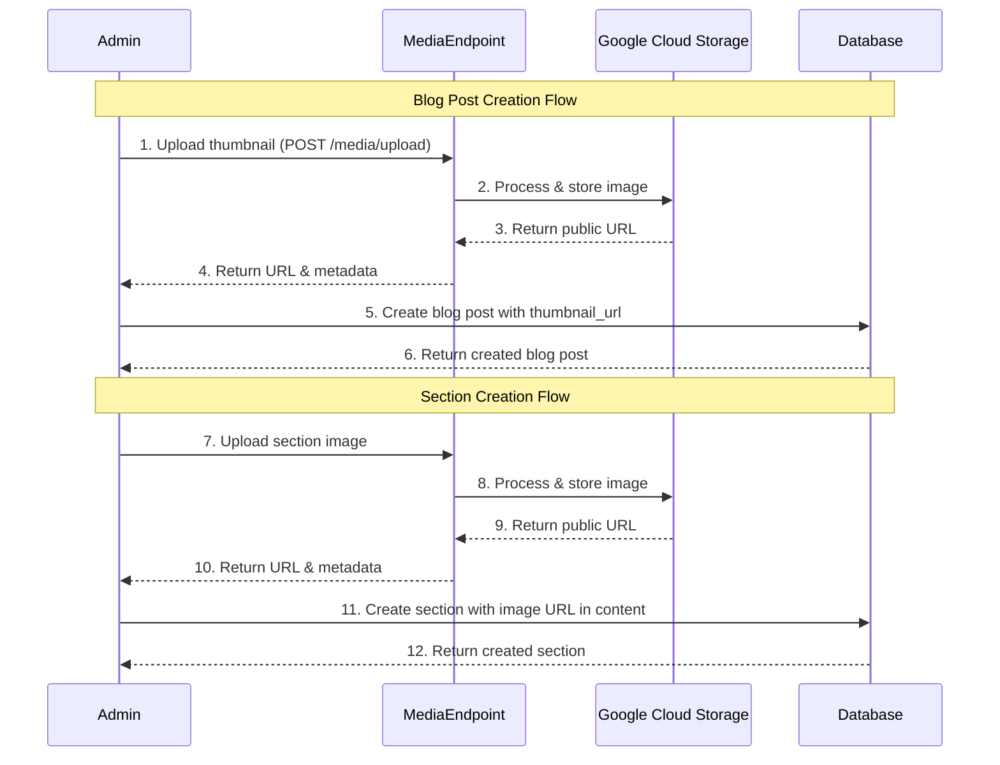

# Frontend Developer Guide: Media Handling Workflow

This document outlines how media is uploaded, stored, and integrated into the system for blog posts and sections. It also includes schemas, workflows, and recommendations to guide the implementation.

## 1. Media Upload and Storage

Media URLs are stored in different places depending on their usage:

-   **Blog Posts:** Stored in the `thumbnail_url` and `cover_url` fields in the `BlogPost` table.
-   **Sections:** Stored within the `content` JSON field of `SectionTranslation`, specifically in `MediaSectionContent` and `HeroSectionContent`.

## 2. Existing Schema Review

### Blog Schema

The blog schema properly stores media URLs:

```typescript
interface BlogPost {
	thumbnail_url?: string
	cover_url?: string
}
```

### Section Schema

The section schema stores media URLs within the content:

```typescript
interface MediaSectionContent {
	image: {
		url: string
		alt: string
		dimensions: {width: number; height: number}
	}
}
```

## 3. Media Handling Workflow

Below is a diagram illustrating the workflow for media handling:



## 4. Real-life Workflow Examples

### For Blog Posts

#### Step 1: Upload Thumbnail

```typescript
POST /api/v1/cms/media/upload
{
    file: [binary],
    type: "blog_thumbnail"
}
// Response:
{
    "url": "https://storage.googleapis.com/scoretrend/blog/thumbnails/example.webp",
    "dimensions": { "width": 300, "height": 300 },
    "size": 102400,
    "format": "webp",
    "type": "blog_thumbnail"
}
```

#### Step 2: Create Blog Post with URL

```typescript
POST /api/v1/cms/blog/posts
{
    "category_id": "...",
    "thumbnail_url": "https://storage.googleapis.com/scoretrend/blog/thumbnails/example.webp",
    "translations": {
        "en": {
            "title": "Example Post",
            "content": "...",
            "alias": "example-post",
            "seo": { ... }
        }
    }
}
```

### For Sections

#### Step 1: Upload Section Image

```typescript
POST /api/v1/cms/media/upload
{
    file: [binary],
    type: "section_content"
}
// Response:
{
    "url": "https://storage.googleapis.com/scoretrend/sections/content/example.webp",
    "dimensions": { "width": 800, "height": 600 },
    "size": 204800,
    "format": "webp",
    "type": "section_content"
}
```

#### Step 2: Create Section with Image URL

```typescript
POST /api/v1/cms/pages/{pageId}/sections
{
    "type": "CONTENT",
    "order_index": 0,
    "translations": {
        "en": {
            "content": {
                "title": "Example Section",
                "description": "...",
                "order": 0,
                "image": {
                    "url": "https://storage.googleapis.com/scoretrend/sections/content/example.webp",
                    "alt": "Example image",
                    "dimensions": {
                        "width": 800,
                        "height": 600
                    }
                }
            }
        }
    }
}
```

## 5. Missing Features and Recommendations

-   **Media Listing Endpoint:**
    While there is no GET endpoint for media listing, this is intentional as media is always associated with content.

## 6. Key Takeaways

1. Media URLs are properly stored in the database.
2. Strong validation ensures correct media types and dimensions.
3. Clear separation between media storage and content association.
4. Proper error handling for failed uploads ensures system robustness.
