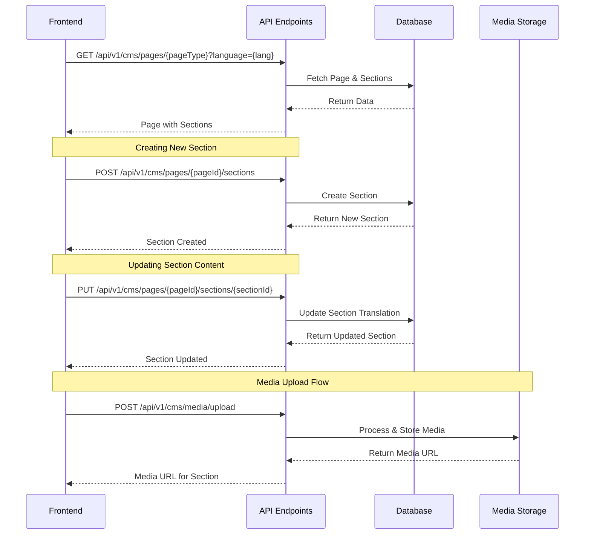
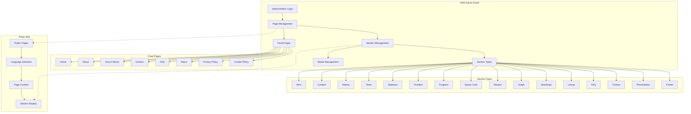
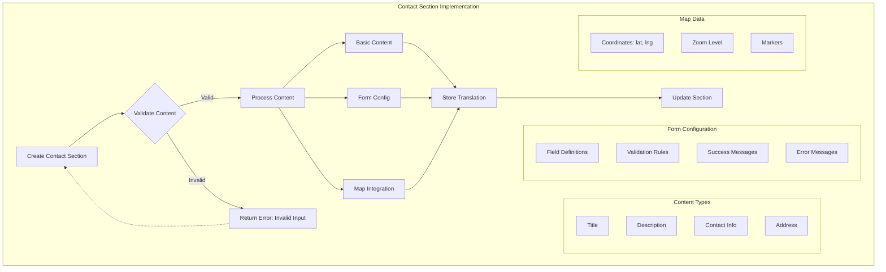
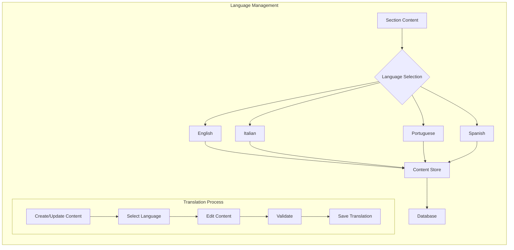
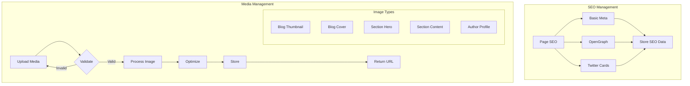
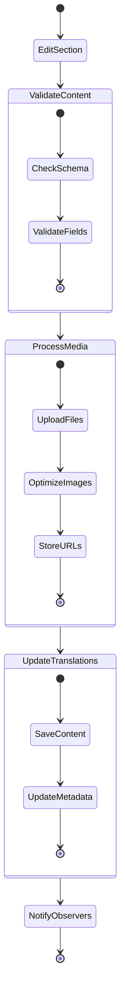
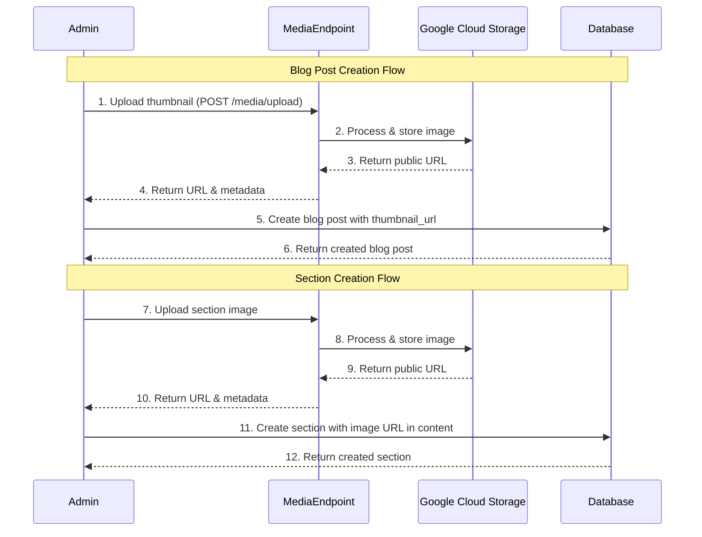

# Scoretrend Workflows and Diagrams

## Section Management Flow



## High-Level System Overview



## Contact Section Implementation



## Multilingual Content Management



## SEO and Media Integration



## Section Update Flow



## Blog and Section Creation Flow



## Media Delete Flow

```mermaid
sequenceDiagram
    participant Admin
    participant Frontend
    participant Backend
    participant Storage

    Admin->>Frontend: Clicks delete button
    Frontend->>Admin: Shows confirmation dialog
    Admin->>Frontend: Confirms deletion
    Frontend->>Backend: DELETE /api/v1/cms/media/delete?url=encoded_url
    Backend->>Backend: Validates admin permissions
    Backend->>Backend: Validates and decodes URL
    Backend->>Storage: Deletes file
    Storage->>Backend: Confirms deletion
    Backend->>Frontend: Returns success response
    Frontend->>Admin: Shows success message
    Frontend->>Frontend: Updates UI (removes thumbnail)               